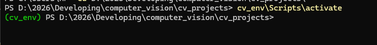

# Computer Vision Projects using OpenCV :

## Projects :

1- face detection.

2- hand gesture volume control.

3- Send Whatsapp Messages Automatically in Python

## Installations

## Virtual environment to run the packages: <br/>

To run the virtual environment for packages <br/>
1- open powershell <br/>
2- navigate to the project routes <br/>
3- type: `cv_env\Scripts\activate` <br/>
if the script didn't work : <br/>

- open powershell as adminstrator <br/>
- type : `Set-ExecutionPolicy -ExecutionPolicy RemoteSigned -Scope CurrentUser` <br/>
- type Y for yes <br/>
- close powershell & repeat the steps again. <br/>

4- it should show something like this : <br/>
 <br/>
5- install `pip install opencv-python mediapipe==0.10.9 pyautogui protobuf==3.20.3`
<br/>

6- type `python -c "import mediapipe as mp; print(mp.__version__)"` to check if its installed correctly <br/>
it should shows: 0.10.9

7- force VS CODE to use the venv <br/>

- Open VS Code <br/>
- Press Ctrl + Shift + P <br/>
- Select Python: Select Interpreter <br/>
- Choose THIS EXACT PATH: <br/>
  {your_project_route}\cv_env\Scripts\python.exe <br/>
- Restart VS Code completely <br/>

## Issue: Losing the virtual environment

Solution: Recreate the virtual environment <br/>

1 - Delete the broken folder
From:

```
PS D:\2026\Developing\computer_vision\cv_projects>
```

Run:

```
Remove-Item -Recurse -Force .\cv_env
```

If it says the folder doesn’t exist, that’s fine.

2 - Recreate the virtual environment (CRITICAL COMMAND)
Run this exact command:

```
C:\Users\HP\AppData\Local\Programs\Python\Python310\python.exe -m venv cv_env
```

Wait until it finishes. It should return you to the prompt with no errors.

3 - Verify it was created correctly
Run:

```
dir .\cv_env\Scripts
```

You must now see files like:

```
Activate.ps1
activate.bat
python.exe
pip.exe
```

If you see these, the environment is valid.

4 - Activate (PowerShell)
``.\cv_env\Scripts\Activate.ps1`

Your prompt must change to:

```
(cv_env) PS D:\2026\Developing\computer_vision\cv_projects>
```

5 - Install your packages (inside the venv)
With (cv_env) visible:

```
pip install opencv-python mediapipe==0.10.9 pyautogui protobuf==3.20.3
```

6 - Tell VS Code to use the venv (important)

Open VS Code

```
Ctrl + Shift + P

Python: Select Interpreter
```

Choose:

```
D:\2026\Developing\computer_vision\cv_projects\cv_env\Scripts\python.exe
```

Restart VS Code

## specific installations for projects:

you should install these packages inside your environment or virtual environment

- Whatsapp automated message

`pip install pywhatkit`
